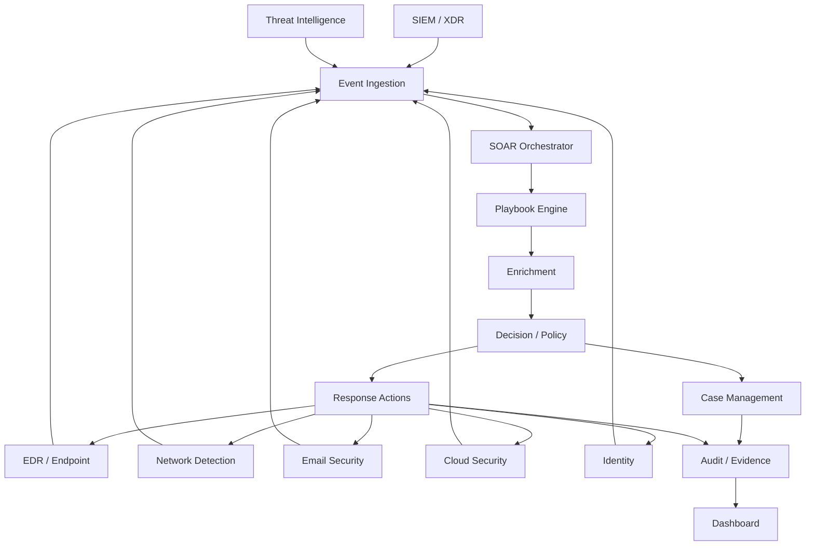
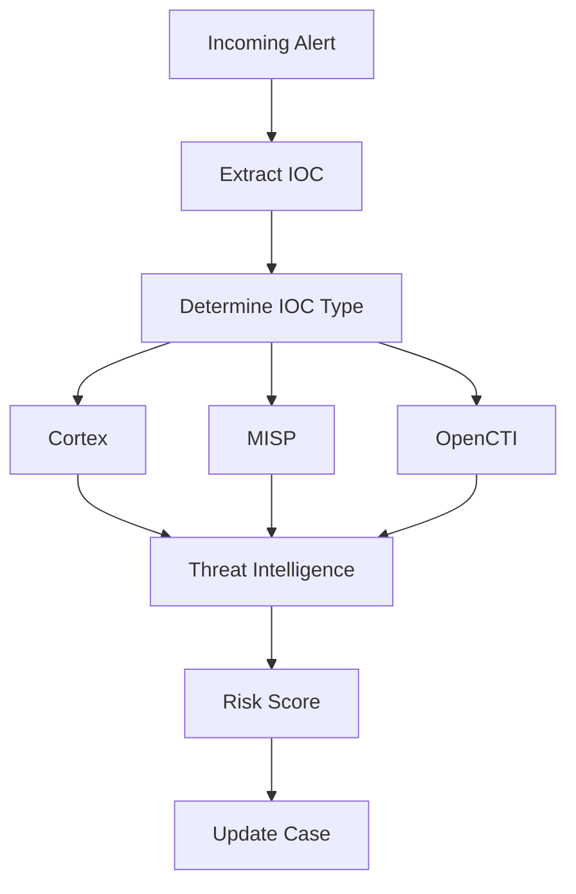
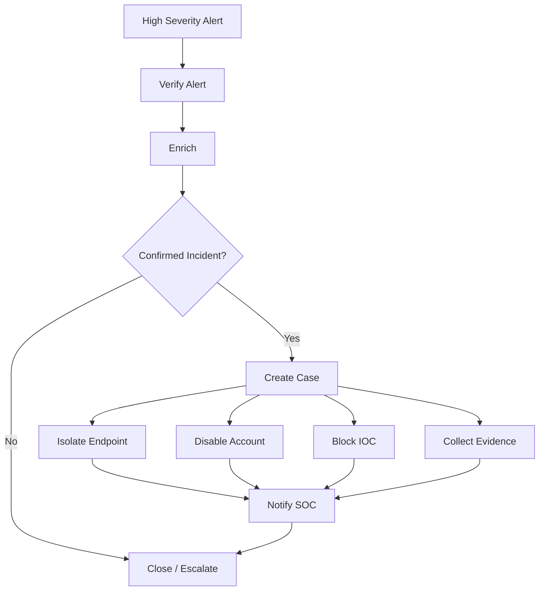
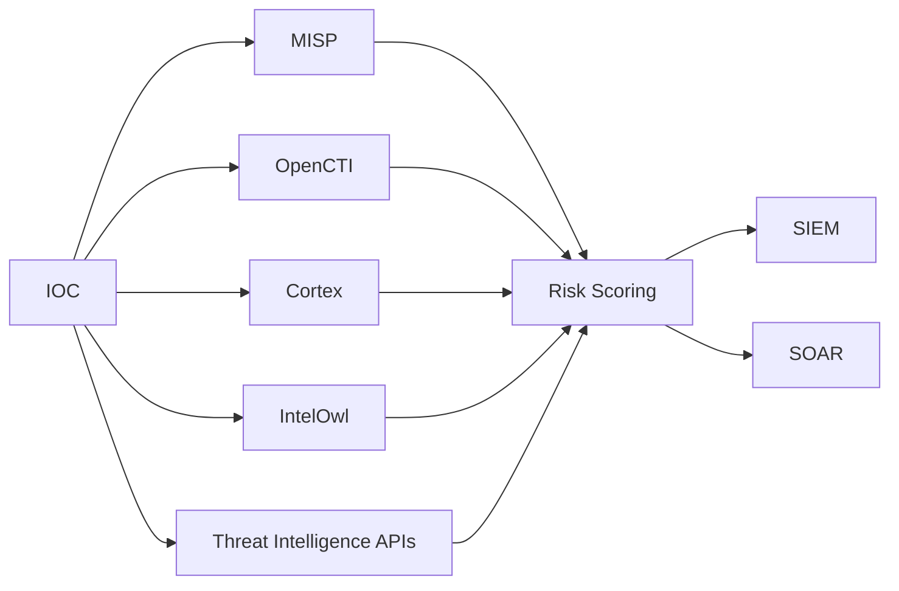
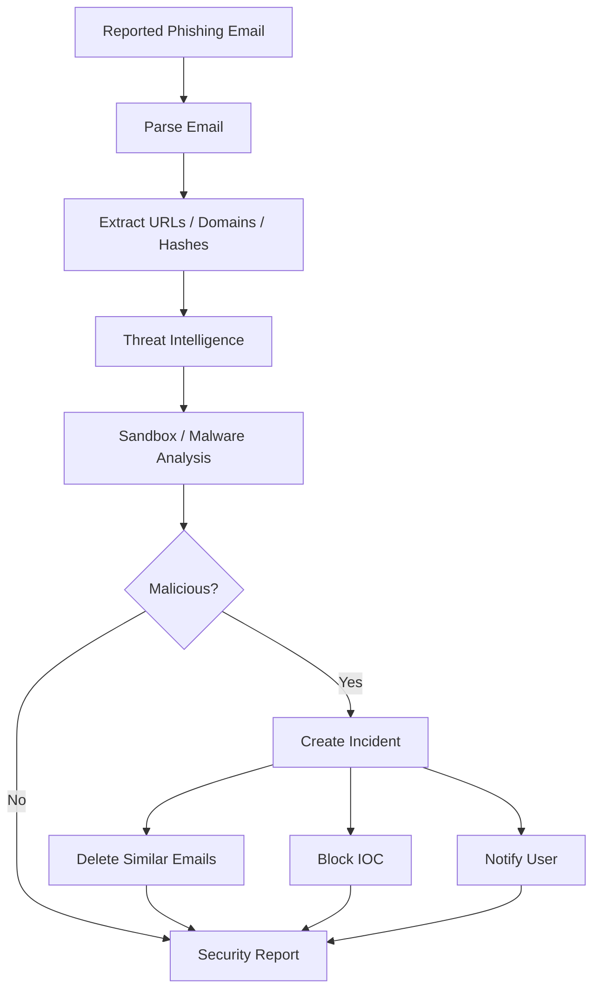
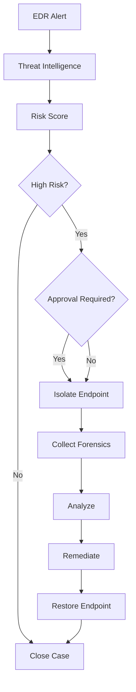
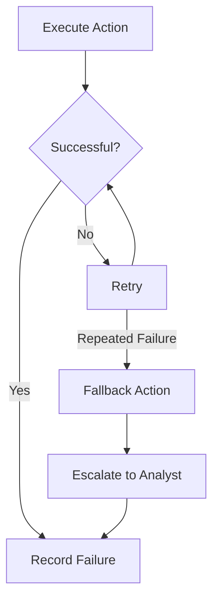
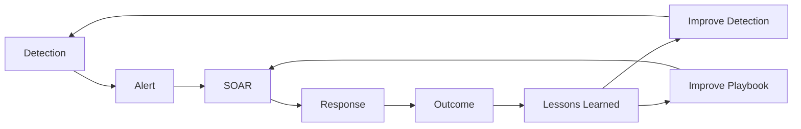

```mermaid

flowchart LR



    ALERT[Security Alert]



    NORMALIZE[Normalize]



    ENRICH[Enrich]



    CORRELATE[Correlate]



    SCORE[Risk Score]



    DECIDE[Decision]



    RESPOND[Response]



    CASE[Create / Update Case]



    AUDIT[Audit]



    CLOSE[Close]



    ALERT --> NORMALIZE

    NORMALIZE --> ENRICH

    ENRICH --> CORRELATE

    CORRELATE --> SCORE

    SCORE --> DECIDE

    DECIDE --> RESPOND

    RESPOND --> CASE

    CASE --> AUDIT

    AUDIT --> CLOSE

```

# 🛡️ Awesome Security Orchestration, Automation & Response (SOAR)

<p align="center">
  
</p>

<p align="center">
  <a href="https://github.com/ishandutta2007/Awesome-Awesome-Awesome"></a><a href="https://discord.gg/jc4xtF58Ve"></a>
  <a href="https://github.com/ishandutta2007/Awesome-Security-Orchestration-Automation-n-Response/stargazers"></a>
  <a href="https://github.com/ishandutta2007/Awesome-Security-Orchestration-Automation-n-Response/network/members"></a>
  <a href="https://github.com/ishandutta2007/Awesome-Security-Orchestration-Automation-n-Response/issues"></a>
  <a href="https://github.com/ishandutta2007/Awesome-Security-Orchestration-Automation-n-Response/blob/main/LICENSE"></a>
  <a href="https://github.com/ishandutta2007"></a>
</p>

> 🚀 **A comprehensive, curated ecosystem of Security Orchestration, Automation, and Response (SOAR) platforms, hyperautomation engines, incident-response orchestration systems, threat-intelligence pipelines, and open-source SOC building blocks.**

**Last updated: September 2026**

Security Orchestration, Automation & Response (**SOAR**) platforms connect security tools and automate repetitive SOC workflows.

A typical SOAR platform receives an alert from a SIEM, EDR, XDR, email-security platform, cloud-security service or threat-intelligence source and then:

```text
Alert ──► Normalize ──► Enrich ──► Correlate ──► Investigate ──► Decide ──► Respond ──► Document ──► Close
```

Examples include **Cortex XSOAR, Splunk SOAR, Tines, Torq, Demisto, Swimlane, DFLabs, Google Security Operations SOAR, FortiSOAR and Siemplify**.

The SOAR market has increasingly divided into two models:
1. **Dedicated / independent SOAR** — platforms such as Tines, Torq and Swimlane.
2. **SOAR embedded inside larger security platforms** — including Cortex XSOAR/XSIAM, Splunk SOAR, Google Security Operations and Microsoft Sentinel automation.

---

## 📌 Table of Contents

- [🏢 SaaS & Hosted Commercial Platforms](#-saas--hosted-commercial-platforms)
- [⭐ Open-Source Leaderboard (Ranked by Stars)](#-open-source-leaderboard-ranked-by-stars)
- [🛠️ Open-Source SOAR Projects](#️-open-source-soar-projects)
- [🚨 Open-Source Incident Response & Case Management](#-open-source-incident-response--case-management)
- [🧠 Open-Source Threat Intelligence Orchestration](#-open-source-threat-intelligence-orchestration)
- [🔬 Open-Source Observable Analysis & Active Response](#-open-source-observable-analysis--active-response)
- [⚡ Open-Source Workflow Automation Engines](#-open-source-workflow-automation-engines)
- [🧱 Open-Source SOC / Security Automation Platforms](#-open-source-soc--security-automation-platforms)
- [📦 Additional Strong Open-Source Options](#-additional-strong-open-source-options)
- [🔄 Commercial Platform → Open-Source Equivalents](#-commercial-platform--open-source-equivalents)
- [🏗️ Frameworks for Building Custom SOAR Platforms](#️-frameworks-for-building-custom-soar-platforms)
- [📐 Reference Architecture & Typical Workflows](#-reference-architecture--typical-workflows)
  - [⚡ Alert Enrichment Workflow](#-alert-enrichment-workflow)
  - [🛡️ Automated Incident Response Workflow](#️-automated-incident-response-workflow)
  - [🎯 Threat Intelligence Workflow](#-threat-intelligence-workflow)
  - [🎣 Phishing Response Workflow](#-phishing-response-workflow)
  - [🛑 Endpoint Isolation Workflow](#-endpoint-isolation-workflow)
- [📊 Capability Matrix](#-capability-matrix)
- [💡 Recommended Open-Source Stacks](#-recommended-open-source-stacks)
- [🤔 What Is Still Difficult to Reproduce in Open Source?](#-what-is-still-difficult-to-reproduce-in-open-source)
- [✨ Why Open Source Is Interesting](#-why-open-source-is-interesting)
- [🤝 How to Contribute](#-how-to-contribute)
- [⚠️ Disclaimer](#️-disclaimer)
- [📈 Star History](#-star-history)

---

## 🏢 SaaS & Hosted Commercial Platforms

> 💡 **Market Size & Industry Dynamics**: The global Security Orchestration, Automation, and Response (SOAR) market is estimated at **$2.4B – $3.8B**, growing at a compound annual growth rate (**CAGR**) of **~16.5%** toward **$8.5B+ by 2032**. The sector is **moderately fragmented transitioning to platform consolidation**, where hyper-scale infrastructure leaders (Microsoft, Google Cloud, Cisco/Splunk, Palo Alto Networks, ServiceNow) integrate native automation into SIEM/XDR suites, while pure-play hyperautomation providers (Tines, Torq, Swimlane) compete on no-code flexibility and vendor-neutral orchestration across multi-cloud environments.

| 🏢 Platform / Product | 📝 Description / Strengths | 💵 Starting Pricing | 🎁 Free Tier / Trial Limit | 📊 Company Scale (Valuation / Revenue) |
| :--- | :--- | :--- | :--- | :--- |
| **[Microsoft Sentinel](https://azure.microsoft.com/products/microsoft-sentinel)** | Cloud-native SIEM + SOAR platform with automated incident response rules, Azure Logic Apps playbooks, and Microsoft Defender XDR integration. | **$2.30/GB ingested** (Analytics Tier Pay-As-You-Go) or 50 GB/day Commitment Tier at **$108/day** (~$2.16/GB); automated workflow actions start at **$0.000025/action**. | **31-day free trial** on Azure Log Analytics workspace with up to **10 GB/day** of free log ingestion; permanent free grant of **5 MB/user/day** for M365 E5/A5/F5/G5 license holders. | **$3.1T+** Market Cap (Microsoft) / **$245B+** Revenue |
| **[Google Security Operations SOAR](https://cloud.google.com/security/products/security-operations)** *(formerly Siemplify / Chronicle)* | Cloud SecOps suite integrating Siemplify threat-centric SOAR playbooks, Chronicle petabyte-scale SIEM, Mandiant threat intelligence, and Gemini AI SOC assistance. | Starts at **~$45,000/year** platform base (covering up to 5 analyst seats; full Google SecOps Enterprise bundles start at **~$85,000/year**). | **30-day enterprise evaluation** / guided Proof-of-Concept (PoC) with full access to 300+ pre-built integrations, visual playbook builder, and simulated incident streams upon request. | **$2.1T+** Market Cap (Alphabet / Google) / **$330B+** Revenue |
| **[Splunk SOAR](https://www.splunk.com/en_us/products/splunk-soar.html)** *(formerly Phantom)* | Enterprise security orchestration, automated investigation, and case management engine integrated with Splunk Enterprise Security and Cisco Security Cloud. | **$0** (Free Community Edition); Commercial subscriptions start at **~$20,000/year** (licensed by automated action volume, starting at 5,000 actions/month). | **Free Community Edition**: permanently free for 1 tenant, up to **100 licensed actions/day** (~3,000 actions/mo), and max 5 concurrent open cases; **30-day** full-feature enterprise free trial. | **$230B+** Market Cap (Cisco Systems) / **$4B+** Splunk ARR |
| **[IBM QRadar SOAR](https://www.ibm.com/products/qradar-soar)** *(formerly Resilient)* | Enterprise incident response case management, dynamic playbooks, and breach notification orchestration, transitioning into Palo Alto Cortex strategic alliance. | Starts at **~$18,000/year** (entry subscription for 5 concurrent analyst users on IBM Cloud Pak for Security / QRadar Suite, ~$300/user/month). | **30-day free trial** on IBM Cloud / Cloud Pak for Security with full incident response workflows, case management, and simulated playbook automations. | **$200B+** Market Cap (IBM) / **$62B+** Revenue |
| **[ServiceNow Security Operations](https://www.servicenow.com/products/security-operations.html)** *(SecOps)* | Enterprise SecOps suite providing Security Incident Response (SIR), Vulnerability Response (VR), and Threat Intelligence natively coupled with the ServiceNow CMDB. | Starts at **~$35,000/year** (~$150/fulfiller analyst/month minimum bundle, typically starting at 20 fulfiller licenses). | **Free Personal Developer Instance (PDI)** permanently accessible via developer.servicenow.com with complete SecOps plugins and workflow builder; **30-day** enterprise guided PoC. | **$190B+** Market Cap / **$10B+** ARR |
| **[Cortex XSOAR & Cortex AgentiX](https://www.paloaltonetworks.com/cortex/cortex-xsoar)** *(Palo Alto Networks)* | Market-defining enterprise SOAR platform featuring interactive War Rooms, 900+ community integrations, Threat Intelligence Management (TIM), and autonomous AgentiX AI agents. | **$0** (Free Community Edition); Commercial licenses start at **~$25,000/year** (Standard tier for up to 1,000 active incidents/month or 5 analyst seats; mid-market bundles start at ~$100,000/year). | **Free Community Edition**: permanently free for 1 user/tenant with full core platform capabilities, marketplace integrations, and rate-limited API requests; **30-day** enterprise evaluation. | **$115B+** Market Cap / **$8B+** Revenue |
| **[FortiSOAR](https://www.fortinet.com/products/siem-soar/fortisoar)** | Enterprise SOAR platform deeply embedded within the Fortinet Security Fabric, featuring multi-tenant MSSP capabilities, visual workflow designer, and 500+ connectors. | Starts at **~$12,500/year** (FortiSOAR Enterprise base license SKU FC-10-FSR01-248-02-12 for 2 concurrent users and 50 active playbooks). | **Free FortiSOAR Trial VM license**: **60-day trial** with full feature functionality, up to 2 concurrent users, and **100 automated playbook executions/day** upon registration. | **$60B+** Market Cap (Fortinet) / **$5.3B+** ARR |
| **[OpenText ArcSight SOAR](https://www.opentext.com/)** | Enterprise SOAR and automated response solution integrated into the OpenText Cybersecurity ArcSight SecOps ecosystem with comprehensive audit tracking. | Starts at **~$15,000/year** (entry-level base subscription for ArcSight SOAR module, or ~$1,250/month for up to 5 analyst seats). | **30-day free trial** through OpenText Cybersecurity portal with up to 50 active playbooks and preconfigured SIEM/EDR connectors. | **$9B+** Market Cap / **$5.8B+** Revenue |
| **[Rapid7 InsightConnect](https://www.rapid7.com/products/insightconnect/)** | Low-code security orchestration and workflow automation platform offering 300+ pre-built plugins and seamless integration with InsightIDR SIEM and InsightVM. | Starts at **~$21,000/year** (baseline package covering 25 active automation workflows/jobs, or ~$1,750/month). | **30-day free trial** with unlimited playbook runs, full connector access, and interactive decision steps across team members. | **$2.5B+** Market Cap / **$820M+** ARR |
| **[Sumo Logic Cloud SOAR](https://www.sumologic.com/solution/cloud-soar)** *(incorporating DFLabs IncMan)* | Cloud-native SOAR engine combining incident response orchestration, Open Integration framework, and automated triage inherited from DFLabs IncMan technology. | Starts at **~$19,200/year** (Sumo Logic Enterprise Security package with Cloud SOAR, ~$1,600/month baseline tier). | **30-day free trial** of Sumo Logic Enterprise Security (includes Cloud SOAR, 1 GB/day log ingestion, and 10 active playbooks). | **$1.7B+** Valuation (Acquired by Francisco Partners) / **$300M+** ARR |
| **[Torq](https://torq.io/)** | Autonomous AI SOC and security hyperautomation engine with visual canvas, parallel processing, and generative AI Socrates triage bot. | Starts at **~$36,000/year** (Hyperautomation Starter tier for up to 50 active workflows; enterprise deployments start at ~$60,000/year). | **14-day free trial** / guided interactive sandbox environment with up to 5 pre-built workflows and 10,000 automation steps; free self-service interactive demo. | **$1.2B+** Valuation ($140M Series C) / **$60M+** ARR |
| **[Tines](https://www.tines.com/)** | Modern no-code security workflow automation and autonomous agent platform with flexible webhook triggers, record stores, and universal API connections. | Starts at **$500/month** ($6,000/year billed annually for Starter tier with 10 stories); Business plans start at **~$25,000/year**. | **Free Community Edition**: permanently free for 1 builder seat, up to **3 active stories (workflows)**, unlimited view-only users, **25,000 events/month**, and **50 AI run credits/month**. | **$700M+** Valuation ($50M Series B extension) / **$50M+** ARR |
| **[NetWitness Orchestrator](https://www.netwitness.com/)** | Threat detection and response orchestration suite designed to integrate SIEM, network NDR, and endpoint telemetry with automated playbook execution. | Starts at **~$18,000/year** (base subscription for NetWitness Orchestrator add-on covering up to 5 analyst consoles). | **30-day trial evaluation** upon partner request with full access to standard incident investigation playbooks. | **$500M+** Valuation (Clearlake / STG RSA spinout) / **$120M+** Revenue |
| **[Swimlane Turbine](https://swimlane.com/)** | Low-code security automation and autonomous SOC platform featuring Turbine high-throughput engine, Hero AI assistants, and case management. | Starts at **~$30,000/year** (Turbine entry tier for up to 5 named users and 500,000 automated actions/month). | **14-day free trial** / interactive Test Flight sandbox with pre-loaded alert triage playbooks and simulated incident feeds. | **$300M+** Valuation / **$40M+** ARR |
| **[Cyware Orchestrate](https://cyware.com/products/cyware-orchestrate)** | Threat-intelligence-infused orchestration and automated incident response platform connecting ISACs, CERTs, and enterprise SOCs. | Starts at **~$24,000/year** (Cyware Orchestrate foundational package, or ~$2,000/month baseline for small SOCs). | **30-day free trial** / interactive sandbox environment with sample threat intelligence feeds and pre-built response playbooks. | **$200M+** Valuation / **$30M+** ARR |
| **[D3 Smart SOAR](https://d3security.com/)** *(D3 Security)* | Independent, multi-tenant SOAR and automated incident investigation system featuring MITRE ATT&CK correlation and transparent two-line billing without token penalties. | Starts at **~$20,000/year** (Platform Subscription plus 3 named analyst seats; MSSP multi-tenant tiers start at ~$45,000/year). | **30-day free trial** / guided proof-of-concept (PoC) with unlimited playbook executions and connector configurations during trial. | **$60M+** Valuation / **$20M+** ARR |

---

## ⭐ Open-Source Leaderboard (Ranked by Stars)

This leaderboard curates premier open-source repositories powering modern security orchestration, incident response, threat-intelligence automation, and autonomous SOC architectures.

| 🏆 Project | 📦 Domain / Focus | ⭐ GitHub Stars | 📜 License | 🔗 Stargazers Link |
| :--- | :--- | :--- | :--- | :--- |
| **[n8n](https://github.com/n8n-io/n8n)** | Workflow Automation & AI Orchestration | [](https://github.com/n8n-io/n8n/stargazers) | Fair-code / Sustainable | [Stargazers](https://github.com/n8n-io/n8n/stargazers) |
| **[Elasticsearch](https://github.com/elastic/elasticsearch)** | Security Analytics & Data Lake Search | [](https://github.com/elastic/elasticsearch/stargazers) | Elastic License / AGPL | [Stargazers](https://github.com/elastic/elasticsearch/stargazers) |
| **[Huginn](https://github.com/huginn/huginn)** | Event-Driven Autonomous Web Agents | [](https://github.com/huginn/huginn/stargazers) | MIT License | [Stargazers](https://github.com/huginn/huginn/stargazers) |
| **[Apache Airflow](https://github.com/apache/airflow)** | Programmatic Workflow Scheduling | [](https://github.com/apache/airflow/stargazers) | Apache-2.0 | [Stargazers](https://github.com/apache/airflow/stargazers) |
| **[Metasploit Framework](https://github.com/rapid7/metasploit-framework)** | Offensive Security & Validation Automation | [](https://github.com/rapid7/metasploit-framework/stargazers) | BSD-3-Clause | [Stargazers](https://github.com/rapid7/metasploit-framework/stargazers) |
| **[Prefect](https://github.com/PrefectHQ/prefect)** | Resilient Python Workflow Pipelines | [](https://github.com/PrefectHQ/prefect/stargazers) | Apache-2.0 | [Stargazers](https://github.com/PrefectHQ/prefect/stargazers) |
| **[Node-RED](https://github.com/node-red/node-red)** | Low-Code Event-Driven Automation | [](https://github.com/node-red/node-red/stargazers) | Apache-2.0 | [Stargazers](https://github.com/node-red/node-red/stargazers) |
| **[osquery](https://github.com/osquery/osquery)** | SQL-Powered Endpoint Instrumentation | [](https://github.com/osquery/osquery/stargazers) | Apache-2.0 | [Stargazers](https://github.com/osquery/osquery/stargazers) |
| **[Temporal](https://github.com/temporalio/temporal)** | Fault-Tolerant Workflow Orchestration | [](https://github.com/temporalio/temporal/stargazers) | MIT License | [Stargazers](https://github.com/temporalio/temporal/stargazers) |
| **[SpiderFoot](https://github.com/smicallef/spiderfoot)** | Automated OSINT & Threat Reconnaissance | [](https://github.com/smicallef/spiderfoot/stargazers) | MIT License | [Stargazers](https://github.com/smicallef/spiderfoot/stargazers) |
| **[Argo Workflows](https://github.com/argoproj/argo-workflows)** | Cloud-Native Kubernetes Pipelines | [](https://github.com/argoproj/argo-workflows/stargazers) | Apache-2.0 | [Stargazers](https://github.com/argoproj/argo-workflows/stargazers) |
| **[Wazuh](https://github.com/wazuh/wazuh)** | Unified Open-Source XDR & SIEM | [](https://github.com/wazuh/wazuh/stargazers) | GPL-2.0 | [Stargazers](https://github.com/wazuh/wazuh/stargazers) |
| **[Semgrep](https://github.com/semgrep/semgrep)** | Static Analysis & Policy Automation | [](https://github.com/semgrep/semgrep/stargazers) | LGPL-2.1 | [Stargazers](https://github.com/semgrep/semgrep/stargazers) |
| **[OpenSearch](https://github.com/opensearch-project/OpenSearch)** | Distributed SIEM & Log Analytics | [](https://github.com/opensearch-project/OpenSearch/stargazers) | Apache-2.0 | [Stargazers](https://github.com/opensearch-project/OpenSearch/stargazers) |
| **[Atomic Red Team](https://github.com/redcanaryco/atomic-red-team)** | Automated ATT&CK Detection Testing | [](https://github.com/redcanaryco/atomic-red-team/stargazers) | MIT License | [Stargazers](https://github.com/redcanaryco/atomic-red-team/stargazers) |
| **[Sigma](https://github.com/SigmaHQ/sigma)** | Generic Detection Rule Standard | [](https://github.com/SigmaHQ/sigma/stargazers) | DRL-1.1 | [Stargazers](https://github.com/SigmaHQ/sigma/stargazers) |
| **[BloodHound](https://github.com/BloodHoundAD/BloodHound)** | Active Directory Attack Path Graphing | [](https://github.com/BloodHoundAD/BloodHound/stargazers) | GPL-3.0 | [Stargazers](https://github.com/BloodHoundAD/BloodHound/stargazers) |
| **[OpenCTI](https://github.com/OpenCTI-Platform/opencti)** | Enterprise Cyber Threat Intelligence | [](https://github.com/OpenCTI-Platform/opencti/stargazers) | Apache-2.0 | [Stargazers](https://github.com/OpenCTI-Platform/opencti/stargazers) |
| **[Falco](https://github.com/falcosecurity/falco)** | Cloud-Native Runtime Security & Alerts | [](https://github.com/falcosecurity/falco/stargazers) | Apache-2.0 | [Stargazers](https://github.com/falcosecurity/falco/stargazers) |
| **[Zeek](https://github.com/zeek/zeek)** | Network Security Monitoring Engine | [](https://github.com/zeek/zeek/stargazers) | BSD-3-Clause | [Stargazers](https://github.com/zeek/zeek/stargazers) |
| **[CALDERA](https://github.com/mitre/caldera)** | MITRE Automated Adversary Emulation | [](https://github.com/mitre/caldera/stargazers) | Apache-2.0 | [Stargazers](https://github.com/mitre/caldera/stargazers) |
| **[Faraday](https://github.com/infobyte/faraday)** | Vulnerability Management Orchestration | [](https://github.com/infobyte/faraday/stargazers) | GPL-3.0 | [Stargazers](https://github.com/infobyte/faraday/stargazers) |
| **[Suricata](https://github.com/OISF/suricata)** | High-Performance Network IDS/IPS | [](https://github.com/OISF/suricata/stargazers) | GPL-2.0 | [Stargazers](https://github.com/OISF/suricata/stargazers) |
| **[StackStorm](https://github.com/StackStorm/st2)** | Event-Driven Security Automation Engine | [](https://github.com/StackStorm/st2/stargazers) | Apache-2.0 | [Stargazers](https://github.com/StackStorm/st2/stargazers) |
| **[MISP](https://github.com/MISP/MISP)** | Threat Intelligence Sharing Platform | [](https://github.com/MISP/MISP/stargazers) | GPL-3.0 | [Stargazers](https://github.com/MISP/MISP/stargazers) |
| **[Dispatch](https://github.com/Netflix/dispatch)** | Netflix Crisis & Incident Management | [](https://github.com/Netflix/dispatch/stargazers) | Apache-2.0 | [Stargazers](https://github.com/Netflix/dispatch/stargazers) |
| **[DefectDojo](https://github.com/DefectDojo/django-DefectDojo)** | OWASP Vulnerability Management & Triaging | [](https://github.com/DefectDojo/django-DefectDojo/stargazers) | BSD-3-Clause | [Stargazers](https://github.com/DefectDojo/django-DefectDojo/stargazers) |
| **[IntelOwl](https://github.com/intelowlproject/IntelOwl)** | Threat Intelligence Orchestration Engine | [](https://github.com/intelowlproject/IntelOwl/stargazers) | AGPL-3.0 | [Stargazers](https://github.com/intelowlproject/IntelOwl/stargazers) |
| **[Velociraptor](https://github.com/Velocidex/velociraptor)** | Endpoint Forensics & Automated Response | [](https://github.com/Velocidex/velociraptor/stargazers) | AGPL-3.0 | [Stargazers](https://github.com/Velocidex/velociraptor/stargazers) |
| **[Malwoverview](https://github.com/alexandreborges/malwoverview)** | Malware Triage & Intel Aggregation | [](https://github.com/alexandreborges/malwoverview/stargazers) | GPL-3.0 | [Stargazers](https://github.com/alexandreborges/malwoverview/stargazers) |
| **[TheHive](https://github.com/TheHive-Project/TheHive)** | Security Incident Response & Case Mgmt | [](https://github.com/TheHive-Project/TheHive/stargazers) | AGPL-3.0 | [Stargazers](https://github.com/TheHive-Project/TheHive/stargazers) |
| **[Shuffle](https://github.com/Shuffle/Shuffle)** | Direct Open-Source SOAR Platform | [](https://github.com/Shuffle/Shuffle/stargazers) | AGPL-3.0 | [Stargazers](https://github.com/Shuffle/Shuffle/stargazers) |
| **[Yeti](https://github.com/yeti-platform/yeti)** | Threat Intelligence & Observable Repository | [](https://github.com/yeti-platform/yeti/stargazers) | Apache-2.0 | [Stargazers](https://github.com/yeti-platform/yeti/stargazers) |
| **[OpenBAS](https://github.com/OpenBAS-Platform/openbas)** | Breach & Attack Simulation Engine | [](https://github.com/OpenBAS-Platform/openbas/stargazers) | Apache-2.0 | [Stargazers](https://github.com/OpenBAS-Platform/openbas/stargazers) |
| **[Matano](https://github.com/matanolabs/matano)** | Serverless Security Data Lake & Detections | [](https://github.com/matanolabs/matano/stargazers) | Apache-2.0 | [Stargazers](https://github.com/matanolabs/matano/stargazers) |
| **[Cortex](https://github.com/TheHive-Project/Cortex)** | Observable Analysis & Active Response | [](https://github.com/TheHive-Project/Cortex/stargazers) | AGPL-3.0 | [Stargazers](https://github.com/TheHive-Project/Cortex/stargazers) |
| **[DFIR-IRIS](https://github.com/dfir-iris/iris-web)** | Collaborative DFIR Case Management | [](https://github.com/dfir-iris/iris-web/stargazers) | LGPL-3.0 | [Stargazers](https://github.com/dfir-iris/iris-web/stargazers) |

---

# 🛠️ Open-Source SOAR Projects

These are the most important open-source projects to investigate when building a SOAR platform without depending entirely on a proprietary product.

---

# 1. Shuffle [](https://github.com/Shuffle/Shuffle/stargazers)

[GitHub](https://github.com/Shuffle/Shuffle)

Shuffle is one of the strongest direct open-source SOAR alternatives.

It provides:

* visual workflows

* security automation

* app integrations

* webhooks

* workflow execution

* sub-workflows

* API integrations

* SOC automation

* reusable workflows

Typical architecture:

```text

SIEM

 ↓

Shuffle

 ↓

Enrichment

 ↓

Decision

 ↓

Response

 ↓

Ticket / Case

```

Shuffle is particularly attractive as the central orchestration layer in an open-source SOC.

A real-world open-source SOC automation project demonstrates Shuffle coordinating Wazuh, DFIR-IRIS, OpenCTI and Cortex in an end-to-end alert-processing pipeline.

---

# 2. StackStorm [](https://github.com/StackStorm/st2/stargazers)

[GitHub](https://github.com/StackStorm/st2)

StackStorm is a powerful open-source event-driven automation platform.

It provides:

* sensors

* triggers

* rules

* actions

* workflows

* packs

* integrations

* Python automation

* REST APIs

Conceptually:

```text

Event

  ↓

Trigger

  ↓

Rule

  ↓

Workflow

  ↓

Action

```

StackStorm is broader than security SOAR, but its event-driven architecture makes it highly suitable for security automation.

---

# 3. TheHive [](https://github.com/TheHive-Project/TheHive/stargazers)

[GitHub](https://github.com/TheHive-Project/TheHive)

TheHive is primarily an open-source security incident-response and case-management platform rather than a pure SOAR engine.

It is useful for:

* incidents

* cases

* tasks

* observables

* investigations

* analyst collaboration

* incident workflows

It is particularly powerful when combined with:

```text

TheHive

 +

Cortex

 +

MISP

 +

Shuffle

```

---

# 4. Cortex [](https://github.com/TheHive-Project/Cortex/stargazers)

[GitHub](https://github.com/TheHive-Project/Cortex)

Cortex is an open-source observable-analysis and active-response engine.

It can analyze:

* IP addresses

* domains

* URLs

* email addresses

* hashes

* files

* other observables

Cortex exposes a REST API and can automate analysis through analyzers.

This makes it particularly useful as the **enrichment and action engine** inside a SOAR architecture.

---

# 🚨 Open-Source Incident Response & Case Management

A complete SOAR implementation often needs a dedicated incident-management layer.

## TheHive [](https://github.com/TheHive-Project/TheHive/stargazers)

[GitHub](https://github.com/TheHive-Project/TheHive)

Strong for:

```text

Incident

 ↓

Case

 ↓

Tasks

 ↓

Observables

 ↓

Analysis

 ↓

Response

```

---

## DFIR-IRIS [](https://github.com/dfir-iris/iris-web/stargazers)

[GitHub](https://github.com/dfir-iris/iris-web)

DFIR-IRIS is an open-source incident-response and case-management platform.

Useful for:

* cases

* incidents

* evidence

* observables

* tasks

* IOC management

* analyst collaboration

* incident tracking

It is an excellent alternative to the case-management component of larger SOAR platforms.

---

## OpenCTI [](https://github.com/OpenCTI-Platform/opencti/stargazers)

[GitHub](https://github.com/OpenCTI-Platform/opencti)

OpenCTI is an open-source cyber-threat-intelligence platform.

It provides:

* threat intelligence

* relationships

* observables

* indicators

* threat actors

* malware

* campaigns

* sightings

* enrichment

It is particularly valuable as the intelligence layer behind automated SOAR workflows.

---

## MISP [](https://github.com/MISP/MISP/stargazers)

[GitHub](https://github.com/MISP/MISP)

MISP is one of the most important open-source threat-intelligence sharing platforms.

Useful for:

* IOC collection

* threat intelligence

* event correlation

* indicator sharing

* feeds

* organizations

* enrichment

* automation

MISP can be connected to Cortex, TheHive, Shuffle and other SOC components.

---

# 🧠 Open-Source Threat Intelligence Orchestration

A typical threat-intelligence automation pipeline is:

```text

Indicator

   ↓

MISP / OpenCTI

   ↓

Cortex

   ↓

VirusTotal / WHOIS / DNS / Sandbox

   ↓

Risk

   ↓

SOAR

   ↓

Response

```

Important projects include:

* [MISP](https://github.com/MISP/MISP) [](https://github.com/MISP/MISP/stargazers)

* [OpenCTI](https://github.com/OpenCTI-Platform/opencti) [](https://github.com/OpenCTI-Platform/opencti/stargazers)

* [Cortex](https://github.com/TheHive-Project/Cortex) [](https://github.com/TheHive-Project/Cortex/stargazers)

* [IntelOwl](https://github.com/intelowlproject/IntelOwl) [](https://github.com/intelowlproject/IntelOwl/stargazers)

* [SpiderFoot](https://github.com/smicallef/spiderfoot) [](https://github.com/smicallef/spiderfoot/stargazers)

* [Malwoverview](https://github.com/alexandreborges/malwoverview) [](https://github.com/alexandreborges/malwoverview/stargazers)

* [Yeti](https://github.com/yeti-platform/yeti) [](https://github.com/yeti-platform/yeti/stargazers)

* [OpenBAS](https://github.com/OpenBAS-Platform/openbas) [](https://github.com/OpenBAS-Platform/openbas/stargazers)

---

## IntelOwl [](https://github.com/intelowlproject/IntelOwl/stargazers)

[GitHub](https://github.com/intelowlproject/IntelOwl)

IntelOwl provides an API-oriented intelligence-analysis framework.

It can aggregate analysis from multiple tools and services.

Potential SOAR use:

```text

Suspicious IP

     ↓

IntelOwl

     ↓

Multiple analyzers

     ↓

Aggregated intelligence

     ↓

SOAR decision

```

---

## SpiderFoot [](https://github.com/smicallef/spiderfoot/stargazers)

[GitHub](https://github.com/smicallef/spiderfoot)

SpiderFoot is an automated OSINT reconnaissance platform.

It can be used by SOAR workflows for:

* domain investigation

* IP investigation

* DNS

* WHOIS

* infrastructure discovery

* threat intelligence enrichment

---

## Yeti [](https://github.com/yeti-platform/yeti/stargazers)

[GitHub](https://github.com/yeti-platform/yeti)

Yeti is an open-source threat-intelligence platform designed around observables, indicators and threat intelligence knowledge.

Useful as a threat-intelligence backend for security automation.

---

## OpenBAS [](https://github.com/OpenBAS-Platform/openbas/stargazers)

[GitHub](https://github.com/OpenBAS-Platform/openbas)

OpenBAS is an open-source breach and attack simulation platform.

It is not a conventional SOAR platform, but it can become part of an advanced security automation ecosystem.

Example:

```text

Detection

 ↓

SOAR

 ↓

OpenBAS

 ↓

Attack Simulation

 ↓

Validate Detection

 ↓

Improve Playbook

```

---

# 🔬 Open-Source Observable Analysis & Active Response

These components can perform specific actions that SOAR platforms orchestrate.

## Cortex [](https://github.com/TheHive-Project/Cortex/stargazers)

```text

Observable

   ↓

Analyzer

   ↓

Result

```

Supported analysis concepts include:

* reputation

* malware analysis

* DNS

* WHOIS

* sandboxing

* threat intelligence

* URL analysis

* hash analysis

---

## Wazuh [](https://github.com/wazuh/wazuh/stargazers)

[GitHub](https://github.com/wazuh/wazuh)

Wazuh is primarily an open-source security platform / SIEM-XDR system, but its alerting and active-response capabilities make it useful as a SOAR component.

Example:

```text

Wazuh Alert

    ↓

Webhook

    ↓

Shuffle

    ↓

Enrichment

    ↓

Firewall / Endpoint Action

```

---

## Suricata [](https://github.com/OISF/suricata/stargazers)

[GitHub](https://github.com/OISF/suricata)

Suricata can provide:

* IDS

* IPS

* network security events

* EVE JSON

* automated alert triggers

It is a strong event source for SOAR.

---

## Zeek [](https://github.com/zeek/zeek/stargazers)

[GitHub](https://github.com/zeek/zeek)

Zeek provides network telemetry and security events that can trigger automated workflows.

---

## Velociraptor [](https://github.com/Velocidex/velociraptor/stargazers)

[GitHub](https://github.com/Velocidex/velociraptor)

Velociraptor is an advanced open-source endpoint visibility and digital-forensics platform.

SOAR integration can support:

```text

Alert

 ↓

Endpoint Query

 ↓

Collect Artifact

 ↓

Analyze

 ↓

Response

```

---

## osquery [](https://github.com/osquery/osquery/stargazers)

[GitHub](https://github.com/osquery/osquery)

osquery provides SQL-based endpoint visibility.

A SOAR platform can execute queries automatically during investigations.

---

## GRR Rapid Response [](https://github.com/google/grr/stargazers)

[GitHub](https://github.com/google/grr)

GRR provides remote forensic and incident-response capabilities.

It can be used as an endpoint-response component in a larger SOC automation platform.

---

# ⚡ Open-Source Workflow Automation Engines

SOAR does not necessarily require a security-specific workflow engine.

General-purpose open-source automation systems can provide the orchestration layer.

---

## n8n [](https://github.com/n8n-io/n8n/stargazers)

[GitHub](https://github.com/n8n-io/n8n)

n8n provides:

* visual workflows

* webhooks

* API integrations

* conditional logic

* scheduled execution

* custom code

* credentials

* event-driven automation

It is not security-specific, but can be adapted for SOAR.

---

## Node-RED [](https://github.com/node-red/node-red/stargazers)

[GitHub](https://github.com/node-red/node-red)

Node-RED provides event-driven visual workflow automation.

Excellent for:

* webhooks

* API orchestration

* MQTT

* IoT security

* lightweight SOC automation

---

## Windmill [](https://github.com/windmill-labs/windmill/stargazers)

[GitHub](https://github.com/windmill-labs/windmill)

Windmill provides developer-oriented workflows and automation.

Useful for:

* Python scripts

* TypeScript

* APIs

* jobs

* workflows

* internal security tooling

---

## Kestra [](https://github.com/kestra-io/kestra/stargazers)

[GitHub](https://github.com/kestra-io/kestra)

Kestra is an open-source orchestration platform.

Useful for:

* event-driven workflows

* scheduled workflows

* API automation

* complex pipelines

* security automation

---

## Temporal [](https://github.com/temporalio/temporal/stargazers)

[GitHub](https://github.com/temporalio/temporal)

Temporal is a powerful workflow engine for durable execution.

It is especially valuable for security workflows where actions may take minutes, hours or days.

Example:

```text

Incident

 ↓

Approval

 ↓

Endpoint Isolation

 ↓

Wait for Analyst

 ↓

Credential Rotation

 ↓

Validation

 ↓

Close

```

---

## Apache Airflow [](https://github.com/apache/airflow/stargazers)

[GitHub](https://github.com/apache/airflow)

Airflow can orchestrate scheduled security jobs, enrichment pipelines and batch intelligence workflows.

---

## Dagster [](https://github.com/dagster-io/dagster/stargazers)

[GitHub](https://github.com/dagster-io/dagster)

Dagster is useful for data-centric security workflows and threat-intelligence pipelines.

---

## Argo Workflows [](https://github.com/argoproj/argo-workflows/stargazers)

[GitHub](https://github.com/argoproj/argo-workflows)

Excellent for Kubernetes-native security automation.

---

## Rundeck [](https://github.com/rundeck/rundeck/stargazers)

[GitHub](https://github.com/rundeck/rundeck)

Rundeck provides operational runbook automation.

It can be useful for:

* response procedures

* infrastructure actions

* incident remediation

* privileged operational workflows

---

# 🧱 Open-Source SOC / Security Automation Platforms

A complete open-source SOC can combine:

```text

SIEM

+

SOAR

+

Case Management

+

Threat Intelligence

+

Endpoint Response

+

Network Detection

+

Automation

```

Strong components include:

| Function            | Open-Source Projects            |

| ------------------- | ------------------------------- |

| SOAR                | Shuffle, StackStorm             |

| Incident Response   | TheHive, DFIR-IRIS              |

| Threat Intelligence | MISP, OpenCTI, Yeti             |

| Observable Analysis | Cortex, IntelOwl                |

| SIEM/XDR            | Wazuh, OpenSearch               |

| Network IDS         | Suricata, Zeek                  |

| Endpoint Response   | Velociraptor, osquery, GRR      |

| Malware Analysis    | CAPE, Cuckoo                    |

| Vulnerability       | Greenbone / OpenVAS             |

| Case Management     | TheHive, DFIR-IRIS              |

| Workflow            | n8n, Node-RED, Temporal, Kestra |

| Policy              | OPA, Kyverno                    |

| Identity            | Keycloak, OpenFGA               |

| Dashboards          | Grafana, OpenSearch Dashboards  |

---

# 📦 Additional Strong Open-Source Options

## SOAR / Automation

* [Shuffle](https://github.com/Shuffle/Shuffle) [](https://github.com/Shuffle/Shuffle/stargazers)

* [StackStorm](https://github.com/StackStorm/st2) [](https://github.com/StackStorm/st2/stargazers)

* [n8n](https://github.com/n8n-io/n8n) [](https://github.com/n8n-io/n8n/stargazers)

* [Node-RED](https://github.com/node-red/node-red) [](https://github.com/node-red/node-red/stargazers)

* [Windmill](https://github.com/windmill-labs/windmill) [](https://github.com/windmill-labs/windmill/stargazers)

* [Kestra](https://github.com/kestra-io/kestra) [](https://github.com/kestra-io/kestra/stargazers)

* [Temporal](https://github.com/temporalio/temporal) [](https://github.com/temporalio/temporal/stargazers)

* [Rundeck](https://github.com/rundeck/rundeck) [](https://github.com/rundeck/rundeck/stargazers)

* [Apache Airflow](https://github.com/apache/airflow) [](https://github.com/apache/airflow/stargazers)

* [Dagster](https://github.com/dagster-io/dagster) [](https://github.com/dagster-io/dagster/stargazers)

* [Argo Workflows](https://github.com/argoproj/argo-workflows) [](https://github.com/argoproj/argo-workflows/stargazers)

* [Ansible](https://github.com/ansible/ansible)

* [Salt](https://github.com/saltstack/salt)

## Incident Response

* [TheHive](https://github.com/TheHive-Project/TheHive) [](https://github.com/TheHive-Project/TheHive/stargazers)

* [DFIR-IRIS](https://github.com/dfir-iris/iris-web) [](https://github.com/dfir-iris/iris-web/stargazers)

* [Cortex](https://github.com/TheHive-Project/Cortex) [](https://github.com/TheHive-Project/Cortex/stargazers)

* [GRR](https://github.com/google/grr)

* [Velociraptor](https://github.com/Velocidex/velociraptor) [](https://github.com/Velocidex/velociraptor/stargazers)

* [osquery](https://github.com/osquery/osquery) [](https://github.com/osquery/osquery/stargazers)

## Threat Intelligence

* [MISP](https://github.com/MISP/MISP) [](https://github.com/MISP/MISP/stargazers)

* [OpenCTI](https://github.com/OpenCTI-Platform/opencti) [](https://github.com/OpenCTI-Platform/opencti/stargazers)

* [Yeti](https://github.com/yeti-platform/yeti) [](https://github.com/yeti-platform/yeti/stargazers)

* [IntelOwl](https://github.com/intelowlproject/IntelOwl) [](https://github.com/intelowlproject/IntelOwl/stargazers)

* [SpiderFoot](https://github.com/smicallef/spiderfoot) [](https://github.com/smicallef/spiderfoot/stargazers)

* [OpenBAS](https://github.com/OpenBAS-Platform/openbas) [](https://github.com/OpenBAS-Platform/openbas/stargazers)

## Detection

* [Wazuh](https://github.com/wazuh/wazuh) [](https://github.com/wazuh/wazuh/stargazers)

* [Suricata](https://github.com/OISF/suricata) [](https://github.com/OISF/suricata/stargazers)

* [Zeek](https://github.com/zeek/zeek) [](https://github.com/zeek/zeek/stargazers)

* [Falco](https://github.com/falcosecurity/falco) [](https://github.com/falcosecurity/falco/stargazers)

* [Tetragon](https://github.com/cilium/tetragon)

* [Sigma](https://github.com/SigmaHQ/sigma) [](https://github.com/SigmaHQ/sigma/stargazers)

* [YARA](https://github.com/VirusTotal/yara)

## Security Testing

* [Atomic Red Team](https://github.com/redcanaryco/atomic-red-team) [](https://github.com/redcanaryco/atomic-red-team/stargazers)

* [MITRE Caldera](https://github.com/mitre/caldera)

* [Infection Monkey](https://github.com/guardicore/monkey)

* [OpenBAS](https://github.com/OpenBAS-Platform/openbas) [](https://github.com/OpenBAS-Platform/openbas/stargazers)

## Malware Analysis

* [CAPE](https://github.com/kevoreilly/capemon)

* [Cuckoo Sandbox](https://github.com/cuckoosandbox/cuckoo)

* [YARA](https://github.com/VirusTotal/yara)

---

# 🔄 Commercial Platform → Open-Source Equivalents

| Commercial / Hosted Platform          | Closest Open-Source Options               | Notes                                      |

| ------------------------------------- | ----------------------------------------- | ------------------------------------------ |

| **Cortex XSOAR**                      | Shuffle + TheHive + Cortex + MISP/OpenCTI | Strong modular replacement                 |

| **Demisto**                           | Shuffle + TheHive + Cortex                | Demisto is the predecessor of Cortex XSOAR |

| **Splunk SOAR**                       | Shuffle + StackStorm + Wazuh/OpenSearch   | Add SIEM and workflow components           |

| **Tines**                             | Shuffle + n8n + Node-RED                  | Strong workflow-oriented alternatives      |

| **Torq**                              | Shuffle + n8n + Temporal + StackStorm     | Event-driven automation                    |

| **Swimlane**                          | Shuffle + TheHive + DFIR-IRIS             | Workflow + case-management combination     |

| **DFLabs IncMan**                     | TheHive + DFIR-IRIS + Shuffle             | Incident-response oriented                 |

| **Google SOAR**                       | Shuffle + TheHive + Cortex + OpenCTI      | Strong modular alternative                 |

| **Siemplify**                         | Shuffle + TheHive + Cortex                | Siemplify is now part of Google SecOps     |

| **FortiSOAR**                         | Shuffle + StackStorm + Ansible            | Strong orchestration combination           |

| **IBM QRadar SOAR**                   | TheHive + DFIR-IRIS + Shuffle             | Case management + automation               |

| **Rapid7 InsightConnect**             | StackStorm + n8n + Shuffle                | Workflow-oriented                          |

| **Sumo Logic Cloud SOAR**             | Shuffle + TheHive + OpenCTI               | Cloud-independent open stack               |

| **Cyware Orchestrate**                | Shuffle + MISP + OpenCTI                  | Strong CTI-oriented combination            |

| **Microsoft Sentinel SOAR**           | Shuffle + StackStorm + Wazuh              | Add SIEM/workflow components               |

| **ServiceNow SecOps**                 | TheHive + DFIR-IRIS + n8n                 | Case/workflow alternative                  |

| **D3 Smart SOAR**                     | Shuffle + StackStorm + Temporal           | Workflow-centric alternative               |

| **Standalone SOAR**                   | Shuffle                                   | Closest direct OSS starting point          |

| **Security case management**          | TheHive / DFIR-IRIS                       | Strong open-source options                 |

| **Threat-intelligence orchestration** | MISP + OpenCTI + Cortex                   | Mature open-source combination             |

---

# 🏗️ Frameworks for Building Custom SOAR Platforms

A serious open-source SOAR platform can be assembled from several layers.

## 1. Event Ingestion

Sources:

```text

SIEM

EDR

XDR

Firewall

IDS

Email Security

Cloud Security

IAM

Threat Intelligence

Vulnerability Scanner

Ticketing

User Reports

```

Possible open-source components:

* Wazuh

* Suricata

* Zeek

* OpenSearch

* MISP

* OpenCTI

* TheHive

* DFIR-IRIS

---

# 2. Orchestration Engine

Choose one:

```text

Shuffle

StackStorm

Temporal

n8n

Node-RED

Windmill

Kestra

Argo Workflows

Rundeck

```

---

# 3. Case Management

```text

TheHive

DFIR-IRIS

```

---

# 4. Threat Intelligence

```text

MISP

OpenCTI

Yeti

IntelOwl

Cortex

```

---

# 5. Endpoint Response

```text

Velociraptor

osquery

GRR

Wazuh

```

---

# 6. Network Response

```text

Suricata

Zeek

pfSense

OPNsense

iptables/nftables

Cilium

```

---

# 7. Identity Response

A SOAR platform can automate:

```text

Disable User

Reset Password

Revoke Sessions

Revoke Tokens

Force MFA

Remove Group Membership

```

Possible open-source identity systems:

* [Keycloak](https://github.com/keycloak/keycloak)

* [Authentik](https://github.com/goauthentik/authentik)

* [OpenFGA](https://github.com/openfga/openfga)

---

# 8. Cloud Response

A playbook can automatically:

```text

Disable IAM key

Quarantine instance

Modify security group

Revoke session

Block IP

Create snapshot

Collect logs

```

Potential automation components:

* AWS CLI

* Azure CLI

* Google Cloud CLI

* Terraform

* OpenTofu

* Ansible

---

# 9. Communication

SOAR systems frequently integrate:

* Slack

* Mattermost

* Rocket.Chat

* Microsoft Teams

* email

* PagerDuty

* Opsgenie

* ticketing systems

Open-source communication alternatives include:

* [Mattermost](https://github.com/mattermost/mattermost)

* [Rocket.Chat](https://github.com/RocketChat/Rocket.Chat)

---

# 10. Policy & Authorization

Use:

* [Open Policy Agent](https://github.com/open-policy-agent/opa)

* [Kyverno](https://github.com/kyverno/kyverno)

* [OpenFGA](https://github.com/openfga/openfga)

* [Keycloak](https://github.com/keycloak/keycloak)

Example:

```text

IF severity = CRITICAL

AND action = endpoint_isolation

AND environment = production

THEN

    require analyst approval

```

---

# 📐 Reference Architecture



---

# ⚙️ Typical SOAR Workflow



---

# ⚡ Alert Enrichment Workflow



---

# 🛡️ Automated Incident Response Workflow



---

# 🎯 Threat Intelligence Workflow



---

# 🎣 Phishing Response Workflow



---

# 🛑 Endpoint Isolation Workflow



---

# SOAR Playbook Structure

A reusable playbook can be represented as:

```text

playbook/

│

├── trigger

│

├── normalize

│

├── enrich

│   ├── reputation

│   ├── threat-intelligence

│   └── asset-context

│

├── decision

│   ├── severity

│   ├── confidence

│   └── business-impact

│

├── approval

│

├── response

│   ├── isolate

│   ├── block

│   ├── disable

│   └── revoke

│

├── evidence

│

├── notification

│

└── close

```

---

# SOAR Playbook Categories

A mature SOC can automate many recurring workflows.

## Identity

```text

Impossible Travel

Brute Force

MFA Fatigue

Compromised Account

Privilege Escalation

Suspicious OAuth Application

```

## Endpoint

```text

Malware

Ransomware

Suspicious Process

EDR Alert

Persistence

Credential Dumping

```

## Network

```text

C2 Communication

Port Scan

DNS Tunneling

Malicious IP

Lateral Movement

```

## Email

```text

Phishing

Malicious Attachment

Malicious URL

Business Email Compromise

Credential Harvesting

```

## Cloud

```text

Exposed Storage

Compromised IAM

Suspicious API Call

Public Security Group

Cryptomining

```

---

# SOAR Automation Levels

A useful maturity model is:

```text

Level 1

---------

Manual response

        ↓

Level 2

---------

Enrichment automation

        ↓

Level 3

---------

Workflow automation

        ↓

Level 4

---------

Decision automation

        ↓

Level 5

---------

Automated response

        ↓

Level 6

---------

Cross-platform orchestration

        ↓

Level 7

---------

Adaptive / AI-assisted automation

        ↓

Level 8

---------

Agentic SOC

```

Automation should increase only when the organization has sufficient confidence, testing, observability and rollback capability.

---

# Human-in-the-Loop Automation

Not every response should be fully automatic.

A mature SOAR architecture can implement:

```text

Low Risk

   ↓

Automatic

Medium Risk

   ↓

Analyst Approval

High Risk

   ↓

Senior Approval

Critical

   ↓

Emergency Response

```

Example:

```text

Block malicious IP

        ↓

Automatic

Disable production administrator

        ↓

Human approval

Delete cloud infrastructure

        ↓

Multiple approvals

```

This reduces the risk of an incorrect automated decision causing a production outage.

---

# SOAR Audit Trail

Every automated action should ideally record:

```text

Incident ID

Playbook ID

Playbook Version

Trigger

Timestamp

Analyst

Automation

Action

Target

Result

Approval

Error

Rollback

```

Example:

```json

{

  "incident": "INC-2026-00124",

  "playbook": "phishing-response",

  "version": "3.2",

  "action": "isolate_endpoint",

  "target": "HOST-001",

  "approved_by": "analyst@example",

  "status": "success"

}

```

---

# SOAR Failure Handling

Automation must assume that integrations fail.



Possible failure modes include:

```text

API timeout

Rate limit

Authentication failure

Expired token

Invalid IOC

Target unavailable

Permission denied

Partial execution

Rollback failure

```

---

# 📊 Capability Matrix

| Capability          | Cortex XSOAR | Splunk SOAR |            Tines |             Torq |         Swimlane |            Shuffle |       StackStorm |          TheHive |        DFIR-IRIS |

| ------------------- | -----------: | ----------: | ---------------: | ---------------: | ---------------: | -----------------: | ---------------: | ---------------: | ---------------: |

| SOAR orchestration  |            ✅ |           ✅ |                ✅ |                ✅ |                ✅ |                  ✅ |                ✅ |               ⚠️ |               ⚠️ |

| Visual workflows    |            ✅ |           ✅ |                ✅ |                ✅ |                ✅ |                  ✅ |               ⚠️ |               ⚠️ |               ⚠️ |

| Security playbooks  |            ✅ |           ✅ |                ✅ |                ✅ |                ✅ |                  ✅ |                ✅ |               ⚠️ |               ⚠️ |

| Case management     |            ✅ |           ✅ |                ✅ |                ✅ |                ✅ |                 ⚠️ |               ⚠️ |                ✅ |                ✅ |

| Threat intelligence |            ✅ |           ✅ |                ✅ |                ✅ |                ✅ |   Via integrations | Via integrations | Via integrations | Via integrations |

| Observable analysis |            ✅ |    Via apps | Via integrations | Via integrations | Via integrations |   Via integrations | Via integrations |       Via Cortex | Via integrations |

| API automation      |            ✅ |           ✅ |                ✅ |                ✅ |                ✅ |                  ✅ |                ✅ |                ✅ |                ✅ |

| Webhooks            |            ✅ |           ✅ |                ✅ |                ✅ |                ✅ |                  ✅ |                ✅ |                ✅ |                ✅ |

| Python automation   |            ✅ |           ✅ |               ⚠️ |               ⚠️ |               ⚠️ |           Via apps |                ✅ | Via integrations | Via integrations |

| Approval workflows  |            ✅ |           ✅ |                ✅ |                ✅ |                ✅ |             Custom |           Custom |           Custom |           Custom |

| RBAC                |            ✅ |           ✅ |                ✅ |                ✅ |                ✅ | Limited / evolving |                ✅ |                ✅ |                ✅ |

| Audit trail         |            ✅ |           ✅ |                ✅ |                ✅ |                ✅ |                  ✅ |                ✅ |                ✅ |                ✅ |

| Open source         |            ❌ |           ❌ |                ❌ |                ❌ |                ❌ |                  ✅ |                ✅ |               ✅* |                ✅ |

| Self-hosted         |            ✅ |           ✅ |                ❌ |                ❌ |                ✅ |                  ✅ |                ✅ |               ✅* |                ✅ |

| SIEM integration    |            ✅ |      Native |         Via APIs |         Via APIs |         Via APIs |                  ✅ |                ✅ | Via integrations | Via integrations |

| Endpoint response   |            ✅ |    Via apps | Via integrations | Via integrations | Via integrations |   Via integrations | Via integrations | Via integrations | Via integrations |

| Workflow engine     |       Native |      Native |           Native |           Native |           Native |             Native |           Native |          Limited |          Limited |

`*` Capabilities, licensing and deployment models can change; verify current project documentation before production deployment.

---

# 💡 Recommended Open-Source Stacks

## 1. Best Overall Open-Source SOAR Stack

```text

Wazuh

   +

Shuffle

   +

TheHive

   +

Cortex

   +

MISP

   +

OpenCTI

```

Architecture:

```text

Wazuh

  ↓

Shuffle

  ↓

Cortex / MISP / OpenCTI

  ↓

TheHive

  ↓

Response

```

This is one of the strongest starting points for a complete open-source SOC automation environment.

---

# 2. Enterprise-Style Open-Source SOC

```text

Wazuh

    +

Shuffle

    +

TheHive

    +

Cortex

    +

MISP

    +

OpenCTI

    +

Velociraptor

    +

Suricata

    +

Zeek

    +

DFIR-IRIS

    +

Keycloak

    +

OpenSearch

```

This provides:

* SIEM

* SOAR

* case management

* CTI

* endpoint response

* network detection

* investigation

* identity

* search

---

# 3. Lightweight SOAR

```text

Shuffle

   +

Wazuh

   +

TheHive

```

Excellent for:

* small SOCs

* labs

* universities

* MSSPs

* security research

* internal security teams

---

# 4. Threat-Intelligence-Centric SOC

```text

MISP

   +

OpenCTI

   +

Cortex

   +

Shuffle

   +

TheHive

```

Strong for organizations where CTI and IOC enrichment are central to incident response.

---

# 5. Incident-Response-Centric SOC

```text

TheHive

   +

Cortex

   +

DFIR-IRIS

   +

Velociraptor

   +

Shuffle

```

Strong for:

* DFIR

* incident response

* endpoint investigations

* evidence collection

* case management

---

# 6. General-Purpose Automation Stack

```text

StackStorm

   +

Ansible

   +

TheHive

   +

MISP

   +

Wazuh

```

Useful when the SOC wants deep infrastructure automation rather than only security-specific playbooks.

---

# 7. Developer-Friendly Security Automation

```text

n8n

   +

Gitleaks

   +

Wazuh

   +

OpenCTI

   +

Slack / Mattermost

```

Useful when security engineering teams want low-code automation.

---

# 8. Kubernetes-Native SOAR

```text

Argo Workflows

      +

Wazuh

      +

OpenSearch

      +

OpenCTI

      +

MISP

      +

Kubernetes

```

Useful for cloud-native SOC environments.

---

# 9. Durable Security Automation

```text

Temporal

   +

TheHive

   +

Cortex

   +

MISP

   +

Velociraptor

```

Particularly useful when workflows can take hours or days and need durable state.

---

# 10. Maximum Open-Source Coverage

```text

                   ┌───────────────┐

                   │    Wazuh      │

                   │     SIEM      │

                   └───────┬───────┘

                           ↓

                   ┌───────────────┐

                   │    Shuffle    │

                   │     SOAR      │

                   └───────┬───────┘

                           ↓

             ┌─────────────┼─────────────┐

             ↓             ↓             ↓

          Cortex         MISP         OpenCTI

             │             │             │

             └─────────────┼─────────────┘

                           ↓

                      TheHive

                           ↓

             ┌─────────────┼─────────────┐

             ↓             ↓             ↓

       Velociraptor     Suricata        Zeek

             │             │             │

             └─────────────┼─────────────┘

                           ↓

                      Response

```

---

# Example SOC Repository

A complete open-source SOAR repository could look like:

```text

soc-automation/

│

├── playbooks/

│   ├── phishing/

│   ├── malware/

│   ├── ransomware/

│   ├── compromised-account/

│   ├── impossible-travel/

│   ├── suspicious-login/

│   ├── malicious-ip/

│   └── cloud-incident/

│

├── integrations/

│   ├── siem/

│   ├── edr/

│   ├── firewall/

│   ├── email/

│   ├── identity/

│   ├── cloud/

│   └── threat-intelligence/

│

├── enrichment/

│   ├── cortex/

│   ├── misp/

│   ├── opencti/

│   └── intelowl/

│

├── response/

│   ├── isolate-endpoint/

│   ├── disable-user/

│   ├── block-ip/

│   ├── quarantine-email/

│   └── revoke-token/

│

├── policies/

│   ├── approval.rego

│   ├── severity.rego

│   └── production.rego

│

├── tests/

│   ├── phishing/

│   ├── malware/

│   └── ransomware/

│

└── README.md

```

---

# Playbook-as-Code

SOAR platforms increasingly benefit from treating playbooks as version-controlled artifacts.

Example:

```yaml

name: suspicious_login_response

trigger:

  type: siem.alert

  severity:

    - high

    - critical

steps:

  - name: enrich_user

    action: identity.lookup

  - name: enrich_ip

    action: cortex.analyze

  - name: threat_intelligence

    action: misp.lookup

  - name: risk_score

    action: risk.calculate

  - name: approval

    condition: risk > 80

  - name: revoke_sessions

    action: identity.revoke_sessions

  - name: create_case

    action: thehive.create_case

```

Advantages:

* Git version control

* peer review

* testing

* rollback

* change history

* CI/CD

* reproducibility

---

# SOAR Testing

A mature SOAR environment should test playbooks before production.

```text

Playbook

   ↓

Unit Test

   ↓

Integration Test

   ↓

Simulation

   ↓

Staging

   ↓

Production

```

Useful testing components include:

* [Atomic Red Team](https://github.com/redcanaryco/atomic-red-team) [](https://github.com/redcanaryco/atomic-red-team/stargazers)

* [MITRE Caldera](https://github.com/mitre/caldera)

* [OpenBAS](https://github.com/OpenBAS-Platform/openbas) [](https://github.com/OpenBAS-Platform/openbas/stargazers)

* synthetic SIEM alerts

* mock APIs

* test tenants

* sandbox environments

---

# SOAR + MITRE ATT&CK

SOAR playbooks can map actions to MITRE ATT&CK techniques.

Example:

```text

Alert:

Credential Dumping

        ↓

ATT&CK:

T1003

        ↓

SOAR:

1. Enrich endpoint

2. Collect forensic artifacts

3. Isolate host

4. Identify account

5. Reset credentials

6. Search for lateral movement

7. Create case

```

This enables:

* coverage measurement

* response mapping

* detection engineering

* purple-team validation

---

# SOAR + Detection Engineering

The strongest SOC architecture closes the loop:



This transforms SOAR from a simple automation system into a **continuous security-operations improvement loop**.

---

# 🤔 What Is Still Difficult to Reproduce in Open Source?

Even with Shuffle, StackStorm, TheHive, Cortex, MISP and OpenCTI, several commercial capabilities remain difficult to reproduce as one integrated product.

## 1. Huge Integration Ecosystems

Commercial platforms can provide large libraries of pre-built integrations, often covering:

```text

SIEM

EDR

XDR

Firewall

Email

IAM

Cloud

Threat Intelligence

Ticketing

Vulnerability

SASE

Network

Identity

SaaS

```

An open-source implementation often requires:

```text

API knowledge

+

Connector development

+

Authentication management

+

Testing

+

Maintenance

```

---

# 2. Enterprise Content Packs

Commercial SOAR platforms often provide pre-built:

```text

Playbooks

Integrations

Dashboards

Incident Types

Fields

Automations

Documentation

```

Open-source platforms may require the SOC to create and maintain much of this content.

---

# 3. Case Management + SOAR Integration

Commercial platforms typically unify:

```text

Alert

+

Case

+

Playbook

+

Investigation

+

Evidence

+

Response

+

Audit

```

Open source often requires multiple projects.

For example:

```text

Shuffle

+

TheHive

+

Cortex

+

MISP

```

---

# 4. High-Quality Integrations

An API connector is easy to write.

A production-grade connector must handle:

```text

Authentication

Rate limits

Pagination

Retries

Timeouts

Version changes

Errors

Permissions

Audit

Idempotency

```

This creates substantial long-term maintenance.

---

# 5. Enterprise RBAC

Complex organizations may require:

```text

SOC Analyst

Senior Analyst

Incident Commander

Threat Hunter

SOC Manager

Security Engineer

Platform Administrator

Auditor

```

with different permissions.

Open-source systems can implement this, but it often requires multiple components.

---

# 6. Compliance

Enterprise customers may require:

```text

SOC 2

ISO 27001

PCI DSS

HIPAA

NIST

FedRAMP

GDPR

```

Open-source software can support the technical controls, but deploying open-source software does not automatically make the resulting SOC compliant.

---

# 7. Agentic SOC

Modern commercial platforms increasingly add:

```text

AI Triage

AI Investigation

AI Playbook Generation

AI Decision Support

Autonomous Enrichment

Agentic Response

```

Reproducing this safely requires more than connecting an LLM to a workflow engine.

A production agentic SOC needs:

```text

Tool permissions

+

Guardrails

+

Confidence thresholds

+

Human approval

+

Audit

+

Rollback

+

Prompt security

+

Data isolation

```

---

# ✨ Why Open Source Is Interesting

The most interesting open-source opportunity is not simply to build another playbook editor.

It is to create a modular:

> **Open-Source Security Operations Automation Platform**

combining:

```text

Detection

+

Orchestration

+

Threat Intelligence

+

Case Management

+

Endpoint Response

+

Network Response

+

Identity Response

+

Cloud Response

+

Policy

+

Audit

```

A possible architecture is:

```text

                     Security Events

                           │

         ┌─────────────────┼─────────────────┐

         ↓                 ↓                 ↓

       Wazuh            Suricata            Zeek

         │                 │                 │

         └─────────────────┼─────────────────┘

                           ↓

                        Shuffle

                           │

             ┌─────────────┼─────────────┐

             ↓             ↓             ↓

          Cortex          MISP         OpenCTI

             │             │             │

             └─────────────┼─────────────┘

                           ↓

                       Decision

                           │

                  ┌────────┴────────┐

                  ↓                 ↓

              TheHive          DFIR-IRIS

                  │                 │

                  └────────┬────────┘

                           ↓

                       Response

                           │

          ┌────────────────┼────────────────┐

          ↓                ↓                ↓

      Velociraptor      Identity         Cloud

          │                │                │

          └────────────────┼────────────────┘

                           ↓

                         Audit

```

---

# Best Open-Source Projects by Use Case

| Use Case                     | Recommended Projects                    |

| ---------------------------- | --------------------------------------- |

| Direct SOAR                  | Shuffle, StackStorm                     |

| Security workflow automation | Shuffle, StackStorm, n8n                |

| Durable automation           | Temporal                                |

| Incident management          | TheHive, DFIR-IRIS                      |

| Observable analysis          | Cortex                                  |

| Threat intelligence          | MISP, OpenCTI, Yeti                     |

| Threat enrichment            | Cortex, IntelOwl, SpiderFoot            |

| SIEM                         | Wazuh, OpenSearch                       |

| Network detection            | Suricata, Zeek                          |

| Endpoint response            | Velociraptor, osquery, GRR              |

| Malware analysis             | CAPE, Cuckoo                            |

| Vulnerability management     | Greenbone / OpenVAS                     |

| Security testing             | Atomic Red Team, MITRE Caldera, OpenBAS |

| Infrastructure response      | Ansible, Salt, Rundeck                  |

| Low-code automation          | n8n, Node-RED, Shuffle                  |

| Kubernetes workflows         | Argo Workflows                          |

| Policy                       | OPA, Kyverno                            |

| Identity                     | Keycloak, OpenFGA                       |

| Dashboards                   | Grafana, OpenSearch Dashboards          |

| Communication                | Mattermost, Rocket.Chat                 |

---

# Recommended Open-Source Shortlist

If the objective is to build a serious open-source alternative to the commercial platforms listed at the beginning of this README, the first projects to investigate are:

## Tier 1 — Direct SOAR

1. [Shuffle](https://github.com/Shuffle/Shuffle)

2. [StackStorm](https://github.com/StackStorm/st2)

## Tier 2 — Incident Response

3. [TheHive](https://github.com/TheHive-Project/TheHive)

4. [DFIR-IRIS](https://github.com/dfir-iris/iris-web)

5. [Cortex](https://github.com/TheHive-Project/Cortex)

## Tier 3 — Threat Intelligence

6. [MISP](https://github.com/MISP/MISP)

7. [OpenCTI](https://github.com/OpenCTI-Platform/opencti)

8. [Yeti](https://github.com/yeti-platform/yeti)

9. [IntelOwl](https://github.com/intelowlproject/IntelOwl)

## Tier 4 — General Workflow Engines

10. [n8n](https://github.com/n8n-io/n8n)

11. [Node-RED](https://github.com/node-red/node-red)

12. [Windmill](https://github.com/windmill-labs/windmill)

13. [Kestra](https://github.com/kestra-io/kestra)

14. [Temporal](https://github.com/temporalio/temporal)

15. [Rundeck](https://github.com/rundeck/rundeck)

## Tier 5 — SOC Infrastructure

16. [Wazuh](https://github.com/wazuh/wazuh)

17. [Suricata](https://github.com/OISF/suricata)

18. [Zeek](https://github.com/zeek/zeek)

19. [Velociraptor](https://github.com/Velocidex/velociraptor)

20. [osquery](https://github.com/osquery/osquery)

---

# Practical Fully Open-Source Reference Stack

A serious open-source SOAR implementation could use:

```text

                           Wazuh

                             │

                             ↓

                          Shuffle

                             │

        ┌────────────────────┼────────────────────┐

        ↓                    ↓                    ↓

      Cortex                MISP                OpenCTI

        │                    │                    │

        └────────────────────┼────────────────────┘

                             ↓

                          TheHive

                             │

                ┌────────────┼────────────┐

                ↓            ↓            ↓

          Velociraptor    Identity       Cloud

                │            │            │

                └────────────┼────────────┘

                             ↓

                           Audit

                             ↓

                          Grafana

```

This provides a modular approximation of the capabilities found across:

* Cortex XSOAR

* Splunk SOAR

* Tines

* Torq

* Swimlane

* DFLabs

* Google Security Operations SOAR

* Siemplify

* FortiSOAR

without requiring a single proprietary SOAR platform.

---

# Open-Source SOAR Maturity Model

```text

                 OPEN-SOURCE SOC AUTOMATION

Level 1

Manual SOC

    ↓

Level 2

IOC Enrichment

    ↓

Level 3

Basic Playbooks

    ↓

Level 4

Incident Automation

    ↓

Level 5

Cross-Tool Orchestration

    ↓

Level 6

Automated Response

    ↓

Level 7

Policy-Governed Automation

    ↓

Level 8

Adaptive / AI-Assisted SOC

```

The most important transition is from:

```text

Automation

```

to:

```text

Controlled Automation

```

where every high-impact action has:

* authorization

* audit

* confidence

* rollback

* exception handling

---

# Conclusion

The SOAR ecosystem has evolved from traditional playbook automation into a broader security-operations automation layer.

The architecture can be understood as:

```text

                   SOAR

                    │

       ┌────────────┼────────────┐

       ↓            ↓            ↓

 Orchestration   Intelligence   Response

       │            │            │

    Shuffle       MISP        Velociraptor

    StackStorm    OpenCTI     Identity

    Temporal      Cortex      Firewall

    n8n            Yeti        Cloud

       │            │            │

       └────────────┼────────────┘

                    ↓

               Case Management

                    │

             ┌──────┴──────┐

             ↓             ↓

          TheHive       DFIR-IRIS

```

For organizations seeking an open-source alternative, there is no requirement to reproduce an entire commercial platform in one project.

A better strategy is to combine specialized components:

```text

Shuffle

+

TheHive

+

Cortex

+

MISP

+

OpenCTI

+

Wazuh

+

Velociraptor

+

Suricata

+

Zeek

```

The most important open-source projects to evaluate first are therefore:

> **Shuffle + StackStorm + TheHive + Cortex + MISP + OpenCTI + DFIR-IRIS + Wazuh + Velociraptor.**

The most interesting opportunity is to build a unified platform around these components that provides:

```text

Detect

 ↓

Normalize

 ↓

Enrich

 ↓

Correlate

 ↓

Investigate

 ↓

Decide

 ↓

Approve

 ↓

Respond

 ↓

Audit

 ↓

Learn

```

That architecture can provide a surprisingly capable open-source foundation for a modern SOC and can reproduce a substantial portion of the functionality traditionally associated with commercial SOAR platforms.

---

# 🤝 How to Contribute

Useful contributions include:

* adding new SOAR integrations

* creating reusable playbooks

* adding SIEM integrations

* adding EDR integrations

* improving threat-intelligence connectors

* adding response actions

* documenting approval workflows

* creating automated tests

* adding MITRE ATT&CK mappings

* improving case-management integrations

* adding incident-response templates

* documenting deployment architectures

* adding Kubernetes deployments

* improving observability

* adding security policies

* documenting human-in-the-loop controls

* creating realistic SOC simulations

Pull requests are welcome.

---

# ⚠️ Disclaimer

This README is an ecosystem overview rather than a security certification, product endorsement or guarantee of production readiness.

Open-source availability, licensing, integrations and project activity can change.

Before deploying an open-source SOAR platform, evaluate:

* project maintenance

* license

* security posture

* authentication

* RBAC

* secrets management

* integration reliability

* API compatibility

* auditability

* workflow testing

* rollback capabilities

* failure handling

* scalability

* HA architecture

* data retention

* compliance requirements

* incident-response procedures

**SOAR automation can cause real operational changes.**

Actions such as:

```text

Disable Account

Isolate Endpoint

Block IP

Revoke Token

Delete Email

Modify Firewall

Terminate Cloud Instance

```

should therefore be protected by appropriate:

```text

Authentication

+

Authorization

+

Approval

+

Confidence

+

Audit

+

Rollback

```

> **Open source makes it possible to construct a powerful SOAR ecosystem from Shuffle, StackStorm, TheHive, Cortex, MISP, OpenCTI, DFIR-IRIS, Wazuh and many other projects. The greatest challenge is no longer simply executing automation—it is creating trustworthy, observable, policy-controlled automation that can safely act on production security incidents.**

---

## 📈 Star History

[](https://star-history.dera.page/#ishandutta2007/Awesome-Security-Orchestration-Automation-n-Response&type=date&legend=top-left)

<p align="center">
  <sub>Maintained with ❤️ by <a href="https://github.com/ishandutta2007">Ishan Dutta</a> and the open-source cybersecurity community.</sub>
</p>
